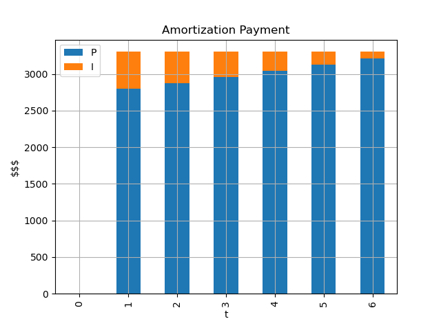

# Amortization

Python CLI that allows you to calculate & plot amortization tables.

## Instructions

1. [Sync your repository](https://www.youtube.com/watch?v=59PaqRdbCx8&list=PLIbTa97DHk7jHdOW7Jb2dozV59bOWc58O&index=7)!
2. Create a branch called: `HW-AMORTIZATION`
3. Complete the `Amortization` class located at: `fintools/src/fintools/amortization`.
4. Complete the `Main` class located at: `src/homework/amortization`
5. Add/commit/push your implementation.
4. Create a PR from `HW-AMORTIZATION` into `solutions`.

Please install the requirements file (again) once you activate your virtualenv:
* `pip install -r requirements.txt`

Note: you can make use of jupyter notebooks or ipython consoles with
* `fintools console`
* `fintools notebook`

Hints:
* You can use the `df.to_string()` method to show a dataframe on the console.

Example: 

```python
from fintools import Amortization

a = Amortization(amount=18000, rate=0.0283, n=6)

a.plot(show=True)
```

## Execution 

**(2.5 pts)** CLI APP: You should be able to get the annuity on the commandline.
* Your implementation should use the `Amortization` class on fintools.

```commandline
$ python -m amortization annuity --amount 18000 --rate 0.0283 --n 6
3304.06
```

**(2.5 pts)** CLI APP: You should be able to show the amortization table on the commandline.
* Your implementation should use the `Amortization` class on fintools.

```commandline
$ python -m amortization table --amount 18000 --rate 0.0283 --n 6
   t         B        A        P      I
0  0 18,000.00      nan      nan    nan
1  1 15,205.34 3,304.06 2,794.66 509.40
2  2 12,331.60 3,304.06 2,873.75 430.31
3  3  9,376.52 3,304.06 2,955.07 348.98
4  4  6,337.82 3,304.06 3,038.70 265.36
5  5  3,213.13 3,304.06 3,124.70 179.36
6  6     -0.00 3,304.06 3,213.13  90.93
```

**(2.5 pts)** CLI APP: You should be able to save the result of an amortization table on a csv file.
* Your implementation should use the `Amortization` class on fintools.
* The `test.csv` file should exists.

```commandline
$ python -m amortization table --amount 18000 --rate 0.0283 --n 6 --save-file amortization/test.csv
   t         B        A        P      I
0  0 18,000.00      nan      nan    nan
1  1 15,205.34 3,304.06 2,794.66 509.40
2  2 12,331.60 3,304.06 2,873.75 430.31
3  3  9,376.52 3,304.06 2,955.07 348.98
4  4  6,337.82 3,304.06 3,038.70 265.36
5  5  3,213.13 3,304.06 3,124.70 179.36
6  6     -0.00 3,304.06 3,213.13  90.93
```

**(2.5 pts)** CLI APP: You should be able to show the plot of an amortization table.
* Your implementation should use the `Amortization` class on fintools.
* The output file should be a png with the matplotlib image.

```commandline
$ python -m amortization plot --amount 18000 --rate 0.0283 --n 6 --save-file amortization/test.png
```

This should be the `test.png` file:


