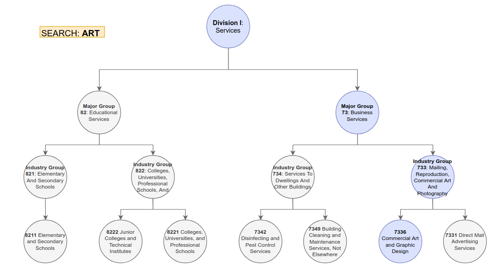

# Industry Search

Use the `StringWrapper` and a recursive solution to search patterns on the `industries.json` file!

## Instructions

1. [Sync your repository](https://www.youtube.com/watch?v=59PaqRdbCx8&list=PLIbTa97DHk7jHdOW7Jb2dozV59bOWc58O&index=7)!
2. Create a branch called: `HW-INDUSTRY-SEARCH`
3. Complete the `search` method on the `Main` class located on `main.py`.
    * You can use (create) auxiliary methods if needed.
    * (5 pts) Use the `StringWrapper` class.
4. Add your implementation, run the examples on the `execution` section, and push to github.
5. Create a PR from `HW-INDUSTRY-SEARCH` into `solutions`.

## Execution!

(5 pts) Your code should behave as demonstrated on this section.

Search for any industry title that contains the word "aquaculture":

```commandline
$ python -m sic-industry search --title 'aquaculture' --exact
2020-10-08 19:17:31,408 [WARNING] sic-industry.main: Execution time 0.004998922348022461
[
    {
        "title": "Division A: Agriculture, Forestry, And Fishing",
        "children": [
            {
                "title": "Major Group 02: Agriculture production livestock and animal specialties",
                "children": [
                    {
                        "title": "Industry Group 027: Animal Specialties",
                        "children": [
                            {
                                "title": "0273 Animal Aquaculture",
                                "children": []
                            }
                        ]
                    }
                ]
            }
        ]
    }
]
```

Search for any industries that resemble the following: "no classifiable"

```commandline
$ python -m sic-industry search --title 'no classifiable'
2020-10-08 19:16:53,269 [WARNING] sic-industry.main: Execution time 0.11453485488891602
[
    {
        "title": "Division J: Public Administration ",
        "children": [
            {
                "title": "Major Group 99: Nonclassifiable Establishments",
                "children": [
                    {
                        "title": "Industry Group 999: Nonclassifiable Establishments",
                        "children": [
                            {
                                "title": "9999 Nonclassifiable Establishments",
                                "children": []
                            }
                        ]
                    }
                ]
            }
        ]
    }
]
```

Exact search should return an empty list:

```commandline
$ python -m sic-industry search --title 'no classifiable' --exact
2020-10-08 19:16:28,198 [WARNING] sic-industry.main: Execution time 0.00604701042175293
[]

```


## Visuals

These are just illustrative examples:




